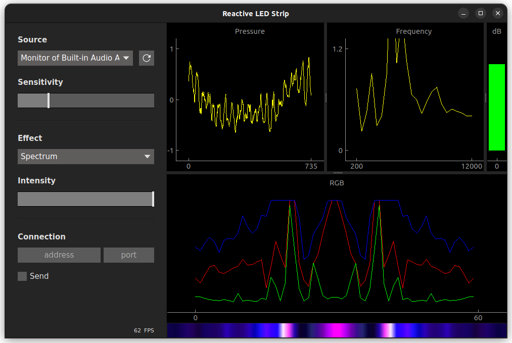

# Audio Reactive LED Strip
Get audio from your computer and transform it in RGB colors that you can send to a led strip.



## Requirements
- Common
  - Python 3.9.19
- Tools
  - make: for running prebuilt commands
    - `sudo apt install make`
  - Qt Design Studio: for designing the UI graphically 
    - `sudo apt install qttools5-dev-tools`
    - [Download website](https://www.qt.io/download-qt-installer)
  - poetry: for managing python dependencies
    - [Download website](https://python-poetry.org/docs/)
  - pyenv: for installing multiple python versions on the system
    - [Download website](https://github.com/pyenv/pyenv)

## Installation

> All commands are executed in the root directory of the project

1. Install python
    ```bash
    pyenv install
    ```
2. Activate environment
    ```bash
    poetry shell 
    ```
3. Install dependencies
    ```bash
    poetry install
    ```

## Commands
- `make rc`: generate the [resources_rc.py](./audio_reactive_led_strip/resources/resources_rc.py)  from the [resources.qrc](./audio_reactive_led_strip/resources/resources.qrc) file edited with Qt Design Studio
- `make gui`: generate the [window.py](./audio_reactive_led_strip/gui/window.py) file from the [window.ui](./audio_reactive_led_strip/gui/window.ui) file edited with Qt Design Studio
- `make run`: run the application
- `make build`: build the application in the *build* directory
- `make clean`: remove the *build* directory

## Uninstall
1. Remove python version
    ```bash
    pyenv uninstall 3.9.19
    ```
2. Remove environment
    ```bash
    rm -rf .venv
    ```